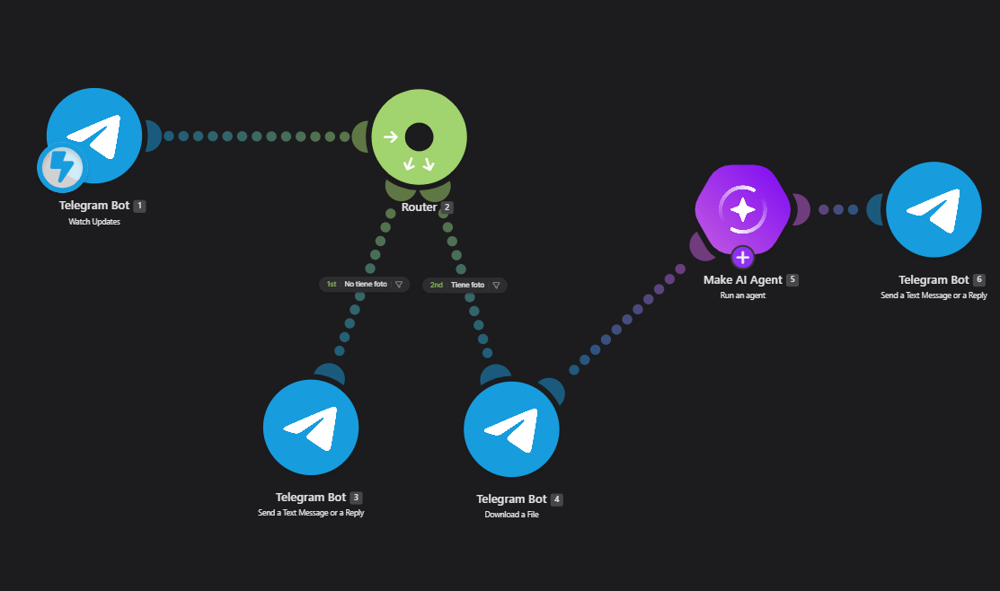
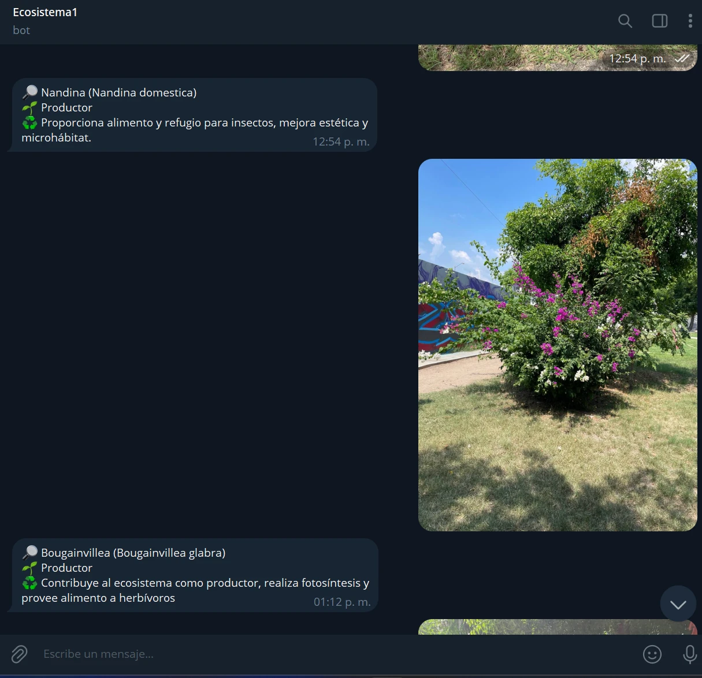
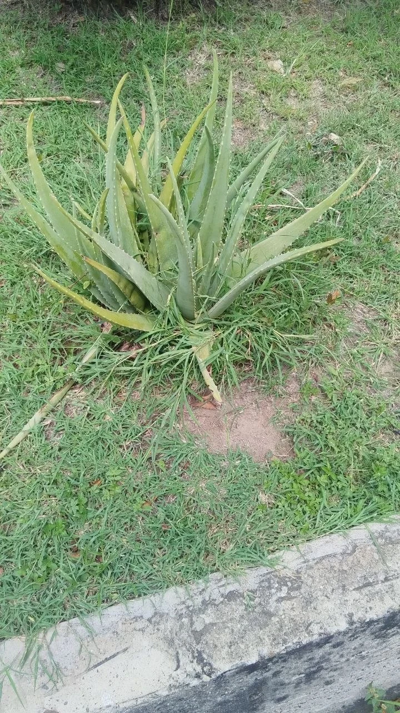

# Nombre del proyecto
2.1 Ecosistema: identificación de organismos con Telegram e IA en Make.com

## Descripción
El alumno toma una foto de un organismo del jardín del Tecnológico y la envía a un bot de Telegram. Un escenario de Make.com recibe el mensaje y, si trae foto, la descarga y se la pasa a un **AI Agent** con visión. El agente identifica el organismo principal de la imagen, lo clasifica como **Productor, Consumidor o Descomponedor** y explica su rol en el ecosistema. El bot responde en el mismo chat en un máximo de 35 palabras. Si el mensaje no trae foto, el bot le pide al alumno que envíe una.

## Objetivos de aprendizaje
- Configurar un disparador de Telegram (webhook) en Make.com.
- Separar el flujo con un **Router** y filtros según el tipo de mensaje (con foto o solo texto).
- Descargar un archivo de Telegram y enviarlo como entrada a un agente de IA.
- Redactar un *system prompt* que limite la respuesta a un formato breve y estructurado en español.
- Reconocer los niveles tróficos de los organismos de un ecosistema real.

## Material utilizado
- Cuenta de Make.com (zona us2.make.com) con el módulo AI Agent
- Bot de Telegram creado con @BotFather ("Ecosistema Bot")
- Make's AI Provider, modelo GPT-5 nano con razonamiento bajo
- Celular con Telegram y cámara

## Diagrama del escenario

📎 [Ver diagrama](Diagrama/Escenario.png)

| # | Módulo | Configuración |
|---|---|---|
| 1 | Telegram Bot – Watch Updates | Conexión: Ecosistema Bot (webhook) |
| 2 | Router | 2 rutas con filtro |
| 3 | Telegram Bot – Send a Text Message or a Reply | Chat ID: `{{1.message.chat.id}}` · Text: "Envíame una foto del organismo (🌱planta, 🐞insecto, 🍄hongo, etc.) para poder identificarlo..." |
| 4 | Telegram Bot – Download a File | File ID: `{{1.message.photo[].file_id}}` |
| 5 | Make AI Agent – Run an agent | GPT-5 nano · Input files: `{{4.fileOutput}}` / `{{4.fileName}}` · Input: "Analiza la imagen adjunta siguiendo tus instrucciones." · Conversation ID vacío · Fallback: No |
| 6 | Telegram Bot – Send a Text Message or a Reply | Chat ID: `{{1.message.chat.id}}` · Text: `{{5.response}}` |

**Filtros del Router**

| Filtro | Ubicación | Condición |
|---|---|---|
| No tiene foto | Router (2) → Send a Text Message (3) | `{{1.message.photo}}` **no existe** |
| Tiene foto | Router (2) → Download a File (4) | `{{1.message.photo}}` **existe** |

## Código
🧩 [Ecosistema.blueprint.json](Codigo/Ecosistema.blueprint.json): blueprint del escenario, con los 6 módulos, los filtros y las instrucciones (system prompt) del AI Agent. Se importa en Make desde **⋯ → Import Blueprint**.

## Terminal
Respuestas del bot en Telegram:

🖥️ [Ver captura del chat](Terminal/RespuestaBot.webp)

## Video del funcionamiento
▶️ [Ver video en YouTube](https://youtube.com/shorts/-S_tsjpR4As?si=0Jf4sVRUw31WJB1A)

## Evidencias
| Foto enviada | Respuesta del bot |
|---|---|
| Nandina | 🔎 Nandina (Nandina domestica) · 🌱 Productor · ♻️ Proporciona alimento y refugio para insectos, mejora estética y microhábitat. |
| Bugambilia con árboles y pasto de fondo | 🔎 Bougainvillea (Bougainvillea glabra) · 🌱 Productor · ♻️ Contribuye al ecosistema como productor, realiza fotosíntesis y provee alimento a herbívoros |

Foto usada para ajustar el prompt (sábila con pasto de fondo):

## Reporte
📑 [Reporte_practica_Ecosistema.pdf](Reporte/Reporte_practica_Ecosistema.pdf)

Incluye datos generales, diagrama del escenario, objetivo, configuración de módulos y filtros, system prompt, funcionamiento, relación con el desarrollo sustentable y conclusión.

## Resultados
📊 [Resultados_Ecosistema.pdf](Resultados/Resultados_Ecosistema.pdf)

## Relación con el desarrollo sustentable
Identificar a los productores, consumidores y descomponedores del jardín ayuda a entender cómo fluyen la energía y la materia en un ecosistema real y por qué hay que conservar su biodiversidad. Con la automatización, cualquier alumno puede hacer este ejercicio de campo desde su celular, sin guías impresas, y las clasificaciones sirven como inventario básico de las especies del campus.

## Conclusiones
Se construyó en Make.com un escenario de seis módulos que conecta un bot de Telegram con un agente de IA con visión. El bot identificó por especie las plantas fotografiadas en el jardín (nandina y bugambilia) y las clasificó como productores. Los filtros del Router separan los mensajes con foto de los que solo traen texto. Ajustar el *system prompt* fue la parte clave: gracias a él, el agente se enfoca en el organismo principal y no en el fondo, y responde con un formato breve y uniforme, adecuado para un chat.
