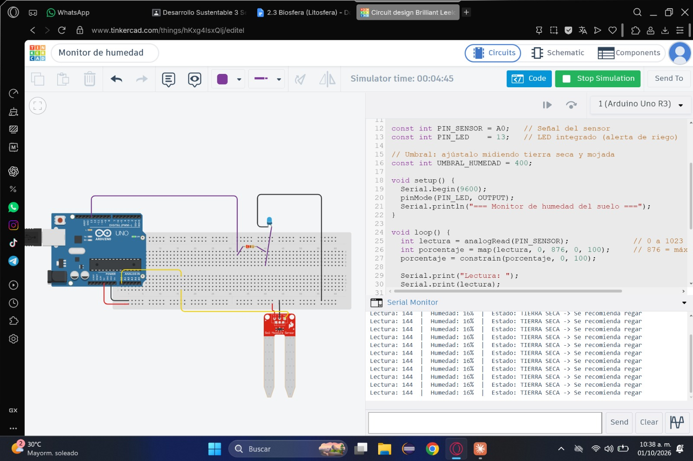
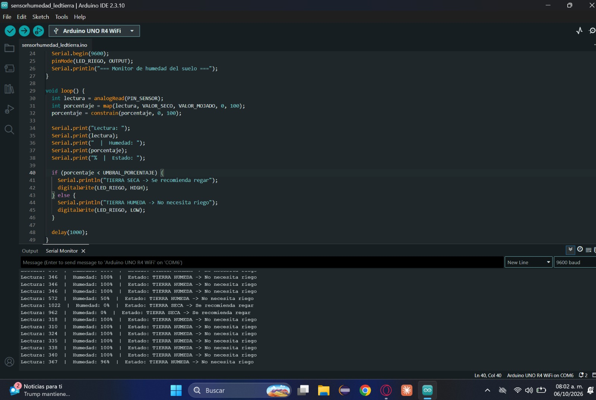
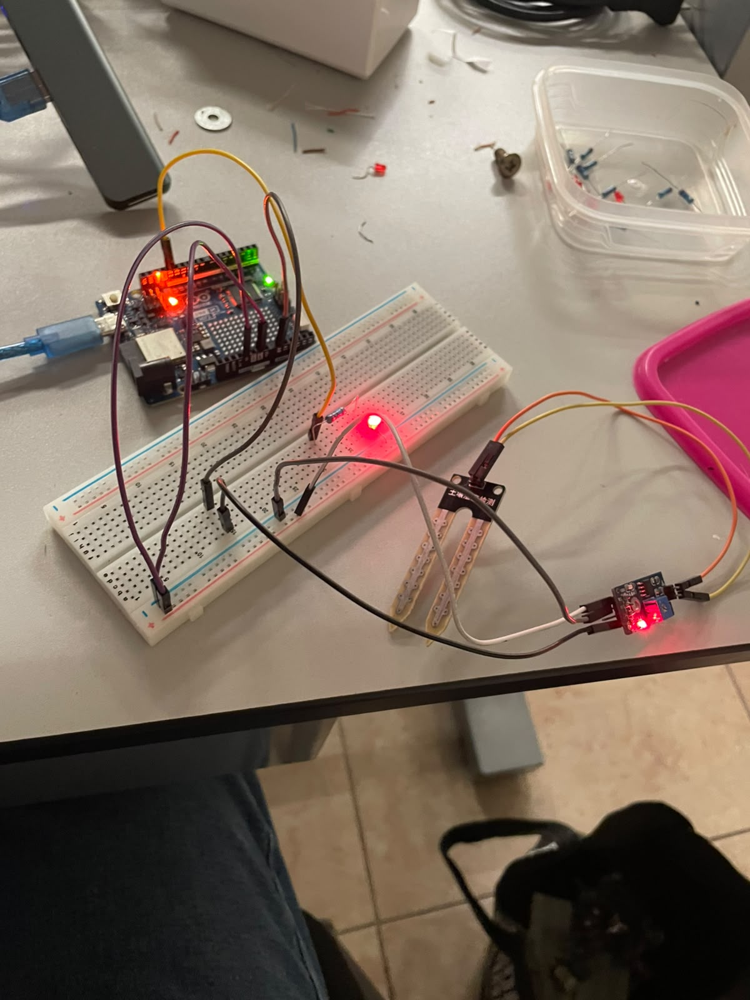

# Nombre del proyecto
2.3 BIOSFERA

## Descripción
Es un **monitor de humedad del suelo con Arduino** que utiliza un sensor para medir la humedad y determinar si la tierra está seca o húmeda. Cuando la humedad es menor al **30 %**, se enciende un LED de alerta y se recomienda regar.

## Objetivos de aprendizaje
- Comprender el funcionamiento de un sensor de humedad del suelo.
- Aprender a conectar y programar un Arduino.
- Interpretar las lecturas de humedad obtenidas.
- Implementar una alerta mediante un LED cuando el suelo esté seco.
- Relacionar la tecnología con el uso eficiente del agua.

## Material utilizado
- 1 Arduino Uno R4 WIFI
- 1 sensor de humedad del suelo
- 1 LED
- 1 resistencia de 220 Ω
- 1 protoboard
- Cables jumper
- Cable USB para Arduino
- Computadora con Tinkercad para la simulación

## Diagrama del circuito

📎 [Ver diagrama](Imagenes/Diagrama.jpeg)

## Código
📄 [SensorHumedad.ino](Codigo/SensorHumedad.ino)

## Terminal

🖥️ [Ver captura de la terminal](Imagenes/TerminalSensorHumedad.jpeg)

## Video del funcionamiento
▶️ [Ver video en YouTube](https://youtu.be/U4793SsLKc4?si=1n5Y0c3STQyjjEJ8)

## Evidencias de armado

## Resultados
📊 [Resultados_Practica_Monitor_Humedad.pdf](Resultados/Resultados_Practica_Monitor_Humedad.pdf)

## Relación con el desarrollo sustentable
Permite ahorrar agua al regar solo cuando el suelo lo necesita.
Ayuda a evitar el desperdicio de agua.
Utiliza tecnología para mejorar el manejo de los recursos naturales.
Promueve un uso más eficiente y responsable del agua.

## Conclusiones
Se logró conectar el sensor para leer la humedad de un vaso con tierra, mientras el sensor esté introducido en la tierra húmeda, apaga el led de aviso y marca la humedad en su totalidad, cuando lo retiran del vaso con tierra
la humedad baja a 0 en su totalidad y enciende el led.
