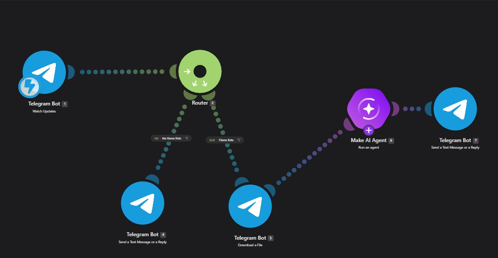
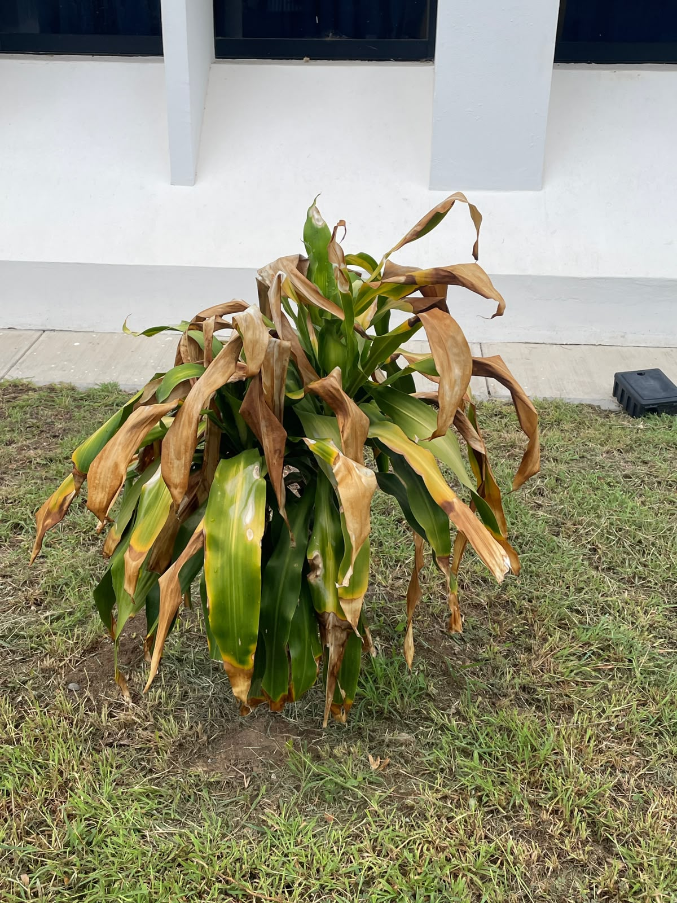
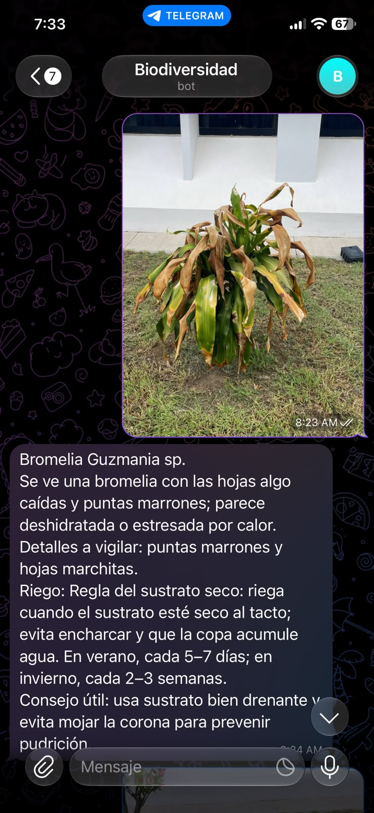

# Nombre del proyecto
BIODIVERSIDAD

## Descripción
En esta práctica se creó un bot de Telegram llamado Biodiversidad, armado en Make, que identifica plantas a partir de una foto. El usuario envía la imagen al bot, un modelo de inteligencia artificial la analiza y responde en el mismo chat con el nombre de la planta, su estado y sus cuidados básicos.

## Objetivos de aprendizaje
* Diseñar un escenario de automatización en Make que conecte un bot de Telegram con un modelo de inteligencia artificial.
* Configurar un bot de Telegram y procesar los datos que recibe, como mensajes y fotografías.
* Redactar instrucciones (prompts) para que la IA identifique plantas y dé recomendaciones de cuidado.
* Aplicar filtros y rutas para manejar distintos casos, como mensajes sin foto.
* Reconocer la utilidad de la tecnología para apoyar el conocimiento y el cuidado de la biodiversidad vegetal.

## Material utilizado
- Cuenta de Make
- Bot de telegram
- Conexion a internet
- Dispositivo con cámara
  
## Diagrama

## Imágenes

## Resultados
[Resultados](Resultados/Resultados_Biodiversidad.pdf)

## Video del funcionamiento
[Ver video en YouTube 📽️](https://youtu.be/pnh3j4m9PoI?si=FV6FOKpcfC9lJec7)

## Conclusiones
La práctica permitió comprobar que es posible combinar herramientas de automatización e inteligencia artificial para crear un asistente útil y fácil de usar. El bot de Telegram identificó correctamente la planta de la foto, detectó que estaba deshidratada y dio recomendaciones claras de cuidado, todo en pocos segundos y desde el celular. Además, se aprendió que pequeños detalles en la configuración, como elegir qué versión de la imagen se descarga, influyen directamente en la calidad de la respuesta. Este tipo de herramientas puede acercar a más personas el conocimiento sobre las plantas y fomentar su cuidado, lo que contribuye a proteger la biodiversidad.
