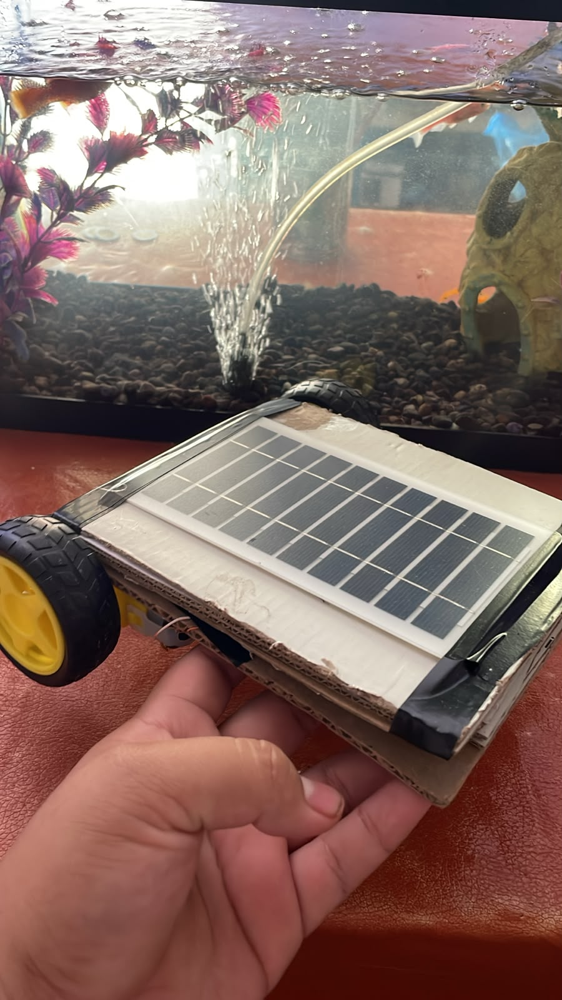
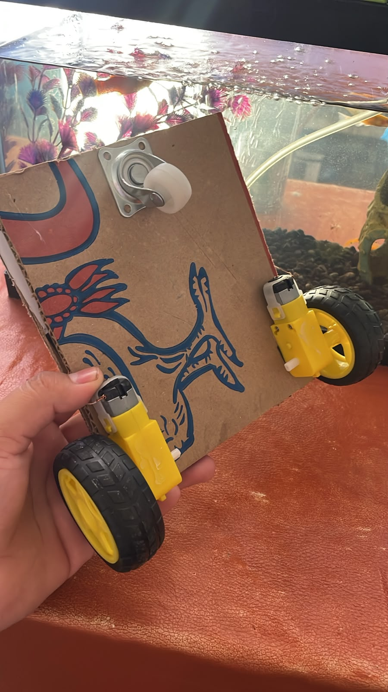

# Nombre del proyecto
Carrito Panel Solar

## Descripción
Carrito que funciona por medio de motorreductores, alimentados con energia solar por medio de un panel solar.

## Objetivos de aprendizaje
Comprender el funcionamiento básico de un panel solar como fuente de energía, aplicar conceptos de circuitos en paralelo para alimentar dos motorreductores de forma simultánea, y experimentar de manera práctica cómo la intensidad de la luz solar afecta el desempeño de un sistema eléctrico.

## Material utilizado
- 2 Motorreductores con llantas
- 1 Rueda loca
- Cable USB
- Panel solar 5v
- Base para el carrito
  
## Diagrama
[Video del cableado](https://youtu.be/6cDTdDiKwVw?si=idxndIGvtgdmEw5z)

## Imágenes

## Reporte
[Reporte](Reporte/Reporte_carrito_solar.pdf)

## Resultados
[Resultados](Resultados/Resultados_Resultados_carrito_solar.pdf)

## Video del funcionamiento
[Ver video en YouTube](https://youtube.com/shorts/SbtoMiKNit0?si=lnFFx4c9K4KA40Vt)

## Conclusiones
Se logró construir y probar un carrito capaz de desplazarse usando únicamente energía solar. Las pruebas confirmaron que su movimiento depende directamente de la cantidad de luz captada por el panel: con poca luz se desplazaba lento, con más luz se movía con normalidad, y en sombra se detenía por completo, demostrando de forma práctica el funcionamiento de la energía solar como fuente de movimiento.
