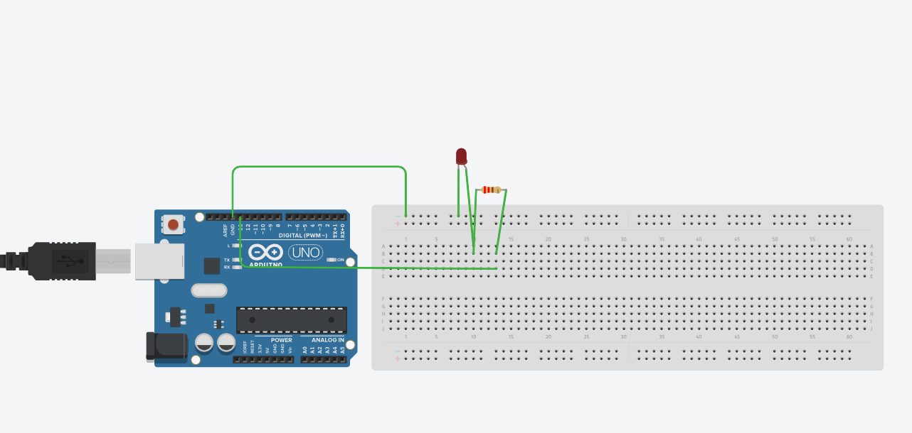
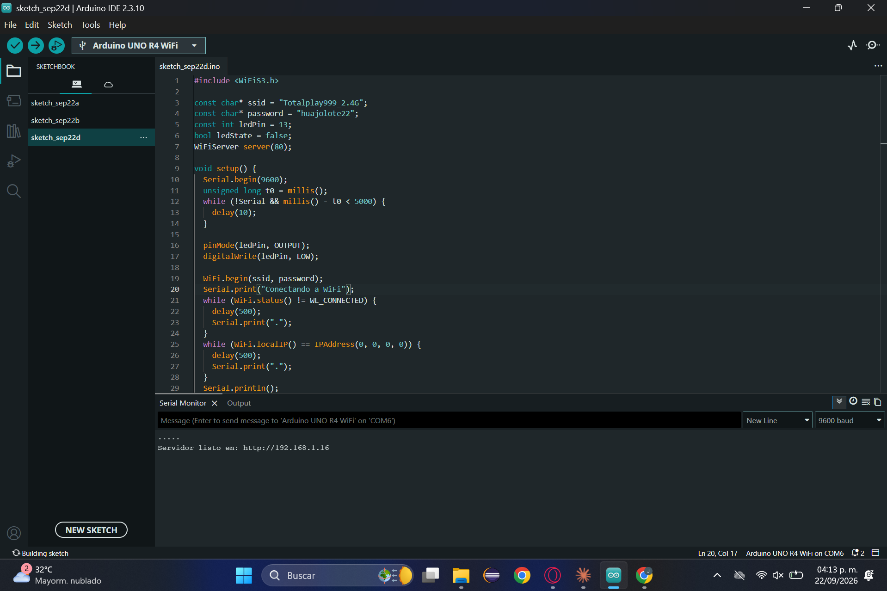

# Nombre del proyecto
Encendido de LED vía web con Arduino (WiFi)

## Descripción
El Arduino UNO R4 WiFi se conecta a la red WiFi y levanta un servidor web en el puerto 80. Desde el navegador de una computadora o celular conectado a la misma red se abre la IP de la placa, que muestra una página "Control de LED" con el estado actual y dos botones: **Encender** (`GET /led/on`) y **Apagar** (`GET /led/off`), que controlan el LED del pin 13.

## Objetivos de aprendizaje
Controlar el encendido y apagado de un LED conectado al pin digital 13 del Arduino desde un navegador web, utilizando el módulo WiFi integrado de la placa para crear un servidor web dentro de la red local.

## Material utilizado
- Arduino UNO R4 WiFi
- Protoboard
- LED rojo
- Resistencia de 220 Ω
- Cables de conexión
- Computadora o celular conectado a la misma red WiFi
- Librería WiFiS3 (incluida en el paquete de placas UNO R4)

## Diagrama del circuito

📎 [Ver diagrama](Diagrama/LedViaWeb.png)

| Componente | Conexión |
|---|---|
| Pin digital 13 | Terminal de la resistencia de 220 Ω |
| Otra terminal de la resistencia | Ánodo del LED (+) |
| Cátodo del LED (−) | Riel negativo (−) del protoboard |
| Riel negativo (−) | GND del Arduino |

## Código
📄 [LedViaWeb.ino](Codigo/LedViaWeb.ino)

## Terminal
Al conectarse, el Monitor Serial muestra la IP del servidor (`Servidor listo en: http://192.168.x.x`).

🖥️ [Ver captura de la terminal](Terminal/TerminalLedViaWeb.png)

## Video del funcionamiento
▶️ [Ver video en YouTube](https://youtu.be/AsJhrTXBEjl?feature=shared)

## Evidencias de armado

## Reporte
📑 [Reporte_practica_LED_via_web.pdf](Reporte/Reporte_practica_LED_via_web.pdf)

Incluye datos generales, diagrama, objetivo, código, funcionamiento, relación con el desarrollo sustentable y conclusión.

## Resultados
📊 [Resultados_LED_via_web.pdf](Resultados/Resultados_LED_via_web.pdf)

## Relación con el desarrollo sustentable
El control remoto de dispositivos es la base de los sistemas domóticos e IoT. Poder encender y apagar una carga a distancia permite apagar luces o equipos olvidados sin desplazarse, lo que reduce el consumo innecesario de energía.

## Conclusiones
Se logró controlar el LED del pin 13 desde el navegador de una computadora o celular conectado a la misma red. La práctica permitió comprender cómo el Arduino puede funcionar como servidor web, recibir peticiones HTTP y responder con una página HTML, así como su potencial para aplicaciones de ahorro energético mediante el control remoto de dispositivos.
