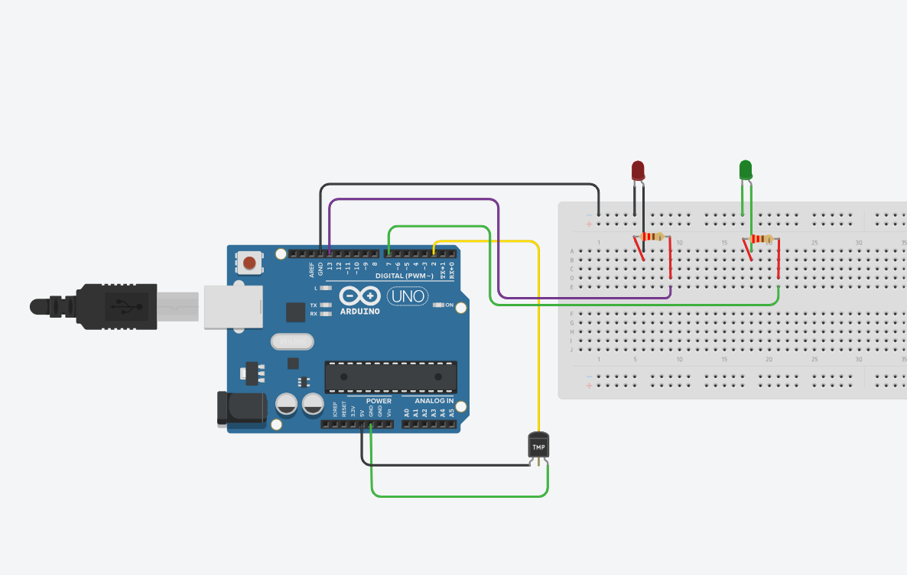

# Nombre del proyecto
Arduino Leer DHT22

## Descripción
Arduino con sensor que mide la temperatura de un cuarto, y mediante make, envia alertas a telegram.

## Objetivos de aprendizaje
Comprender el funcionamiento de sensores digitales de temperatura y humedad (DHT22) y su lectura mediante programación en C++; aplicar conceptos de conectividad WiFi en microcontroladores, incluyendo el manejo de peticiones HTTPS; integrar hardware físico con servicios de automatización en la nube (Make.com) y plataformas de mensajería instantánea (Telegram) para generar notificaciones en tiempo real; y desarrollar habilidades de depuración sistemática ante errores comunes en proyectos de sistemas embebidos conectados a internet.

## Material utilizado
- Arduino UNO R4 WIFI
- Sensor digital de temperatura y humedad DHT22
- Cables jumpers macho-macho y macho-hembra
- 2 leds
- 2 resistencias de 220 ohms
- Protoboard 
- Cable tipo USB C
  
## Diagrama

## Imágenes

## Reporte
[Reporte](Reporte/Reporte_carrito_solar.pdf)

## Resultados
[Resultados](Resultados/Resultados_Resultados_carrito_solar.pdf)

## Video del funcionamiento
[Ver video en YouTube](https://youtu.be/_8vWL7-cy7A?si=326fglBtK0db6jfc)

## Conclusiones
El desarrollo de este proyecto permitió construir un sistema funcional de monitoreo ambiental que combina hardware (Arduino UNO R4 WiFi, sensor DHT22, LEDs indicadores) con servicios en la nube (Make.com, Telegram) para generar alertas automáticas según distintos umbrales de temperatura. A lo largo del proceso se identificaron y resolvieron diversos problemas característicos de proyectos IoT —errores de sintaxis, tiempos de conexión, resistencias incorrectas, drenado incompleto de peticiones HTTP y configuración de automatizaciones—, lo que reforzó la importancia de la depuración metódica paso a paso. El resultado final demuestra que es posible construir soluciones de monitoreo accesibles y de bajo costo, capaces de notificar condiciones ambientales relevantes de forma personalizada y en tiempo real.
